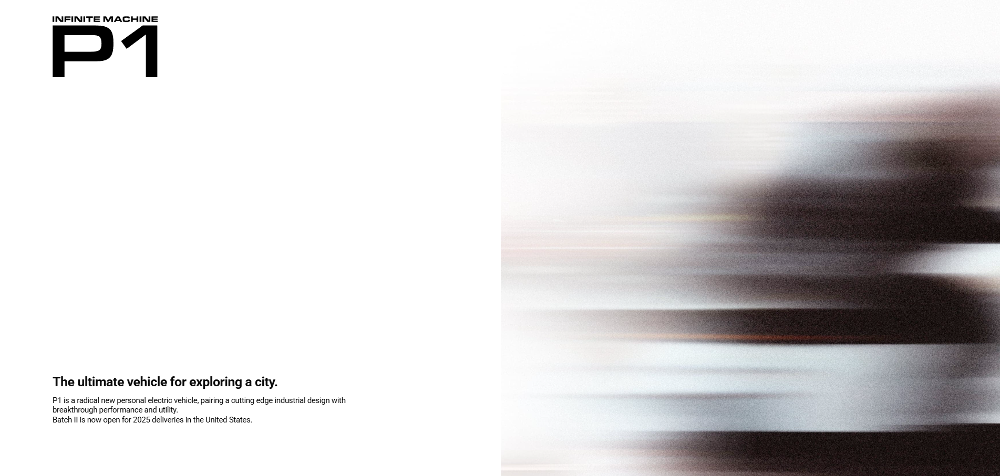

# 🏍️ P1 Electric Vehicle - Interactive Landing Page

> A scroll-based interactive product showcase prototype

![Preview Image]
<p align="left">

</p>
[🔗 Live Demo]([https://your-demo-link.com](https://sticky-vertical-slide.netlify.app/))

---
## 📋 Project Overview

An interactive landing page designed to effectively showcase the features and performance of the P1 electric vehicle.  
Provides a natural visual experience that transitions smoothly as users scroll through the page.

### Key Features
- ✨ **Smooth Scrolling**: Fluid scroll experience using Lenis library (Desktop only)
- 🎬 **Sticky Animations**: Section transitions powered by GSAP ScrollTrigger
- 🎨 **Product Color Switcher**: Real-time product image color changing
- ↔️ **Horizontal Scroll**: Modular accessory showcase section
- 📱 **Responsive Design**: Optimized for both Desktop and Mobile

---

## 🛠️ Tech Stack

### Core
- HTML5, CSS3, JavaScript (ES6+)
- jQuery 3.4.1

### Libraries
- **GSAP 3.x** - Animation control
- **ScrollTrigger** - Scroll-based interactions
- **Lenis** - Smooth scroll
- **Swiper 4.5.1** - Image slider

---

## 💡 Key Implementation

### 1. Responsive Smooth Scroll
```javascript
// Lenis activated only on Desktop (1025px+)
// Native scroll on Mobile for better performance
```
- Automatic scroll method switching by device
- Conditional loading for performance optimization

### 2. Sticky Section Transitions
- 4 background images transitioning sequentially with scroll
- Smooth fade effects synchronized with text content
- Desktop: ScrollTrigger / Mobile: Swiper

### 3. Horizontal Scroll Section
- Browse 4 accessories with horizontal scroll
- Desktop-only feature (standard layout on Mobile)

### 4. Accordion Menu
- Safety/Security information toggle
- slideUp/Down animations synced with Lenis resize

---

## 📝 Disclaimer

This project is a portfolio piece inspired by [Infinite Machine](https://www.infinitemachine.com/).  
All images and content are used for educational purposes and belong to their original owners.
